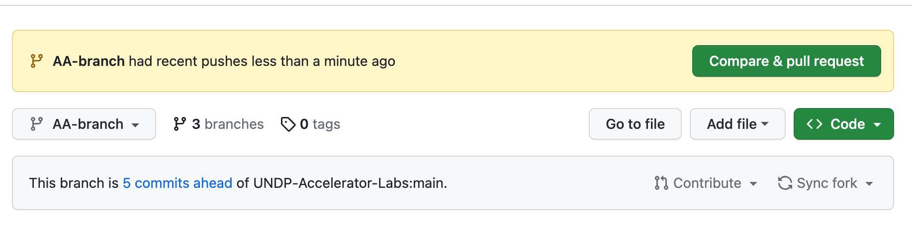

This is a step-by-step guide on how to create a merge request for your changes to the master or main branch using the GitHub UI. This process is crucial when you have changes in your branches that you need to push to the live website.

1. **Commit your changes**: Before you can open a pull request, you must create a commit with your changes and push it to GitHub.

2. **Navigate to the project repository**: Go to your project repository where you want to contribute to.

3. **Switch to the branch**: Switch to the branch which has the changes you want to merge into the master branch.

4. **Click on 'New Pull Request'**: You'll find this button next to the branch drop-down. If you don't see this option, then you might need to push your changes first.

5. **Select the branches**: In the 'base' drop-down menu, select 'master' or 'main'. This is the branch you want to merge your changes into. In the 'compare' drop-down menu, select the branch that contains the changes to be merged.

6. **Review your changes**: On the Open Pull Request page, you'll see a comparison of the changes between your branch (the compare branch) and the repository's master branch (the base branch). Review these changes and ensure they are correct.

7. **Create a pull request**: If everything looks good, click on 'Create Pull Request'. Provide a title and a brief description of your changes. When you're done, click on 'Create Pull Request' again.

8. **Review and approve the merge request**: Someone else on your team should now review the changes. They can comment on them, suggest modifications, or even push follow-up commits if necessary. If everything looks good, they can approve the request.

9. **Merge your Pull Request**: Click on the 'Merge pull request' button to merge the changes into the master branch. Then, you can delete your branch if it's no longer needed.

Remember, always sync your local repository with the upstream repository before making any changes. This ensures you're working with the most recent version of the project. Happy coding! 🚀