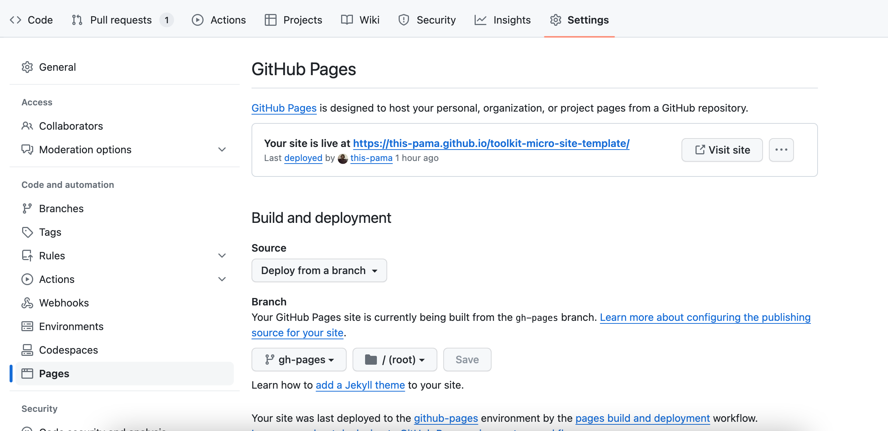
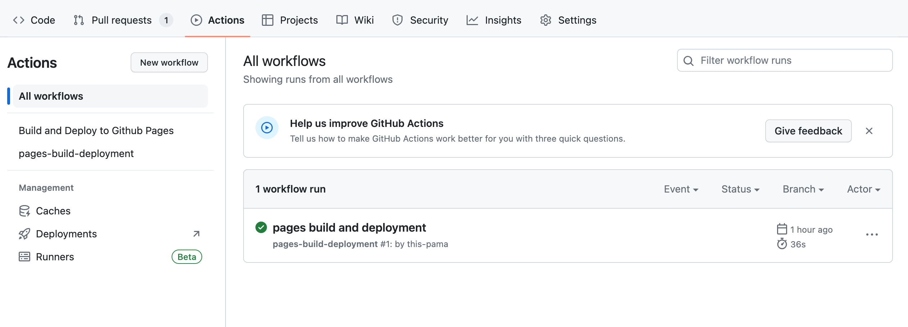

A step-by-step guide on how to publish a repository on GitHub Pages.

## Setting up on GitHub Pages
1. **Navigate to your project repository** on GitHub.
2. **Go to the repository's settings**: Click on the 'Settings' tab.
3. **Scroll down to the GitHub Pages section**: You'll find this towards the bottom of the page.
4. **Choose a branch**: Select the branch you want to use for GitHub Pages from the 'Source' drop-down. Usually, this is the `gh-pages` branch.
5. **Save your changes**: Click on the 'Save' button. Your site will now be accessible at `https://<username>.github.io/<repository>`.

## Updating Your Changes on Live Website

Any direct commit or approved merge request to the `main` branch will automatically deploy your changes to the live website. No additional action is required after this before it goes live.

**Check the deployment status**: You can go to the 'Actions' tab in your repository to see if the automatic deployment was successful.

Remember, GitHub Pages is a static site hosting service, so it doesn't support server-side code like PHP, Ruby, or Python.

Happy coding! 🚀