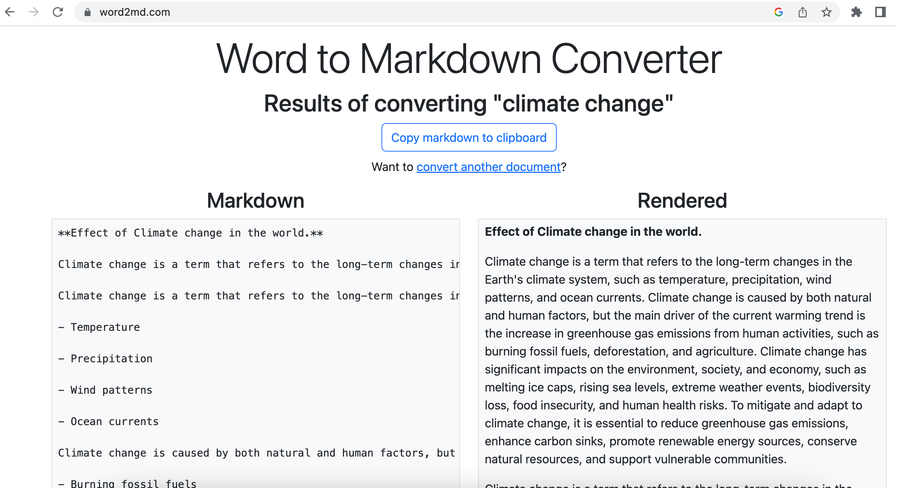
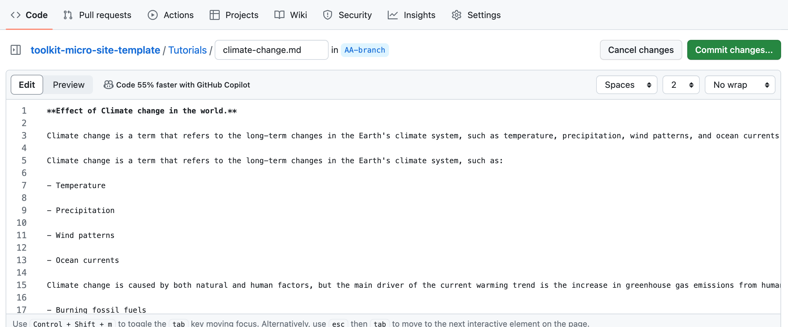

## Method 1: Writing Directly in the Text Editor of GitHub in Markdown Format

1. Navigate to the GitHub project repository where you want to add content. Make sure you are in the branch and/or folder you will like to create a file.
2. Click on the `Add file` button and select `Create new file`.
3. Enter a name for your file with the `.md` extension (for example, `example.md`).
4. In the text editor, you can start writing your content in Markdown format. You can refer to this [Markdown Cheatsheet](https://github.com/adam-p/markdown-here/wiki/Markdown-Cheatsheet) for help with the syntax.

5. As you write, you can click on the `Preview changes` tab at the top of the text editor to see how your Markdown will render.

6. Once you're satisfied with your content, `Commit` the file or changes you have made to the file.
7. Enter a commit message that describes your changes.
8. Choose to commit directly to the `branch_name` branch or create a new branch and start a pull request.
9. Click on `Commit changes`.

## Method 2: Converting a Word Document to a Markdown File

1. Write your content in a Word document.
2. Visit this [Word to Markdown converter](https://word2md.com/).
3. Upload your Word document.
4. The website will convert your document into Markdown format. You can copy this Markdown code.

5. Follow steps 1-4 from Method 1 to create a new `.md` file in your GitHub repository.
6. Paste the copied Markdown code into the text editor.

7. Follow steps 5-9 from Method 1 to preview your changes and commit your new file.

Remember, the `Preview changes` tab is a powerful feature that allows you to view your content as it will appear on GitHub, ensuring that your formatting is correct before you commit your changes. Happy writing! 😊